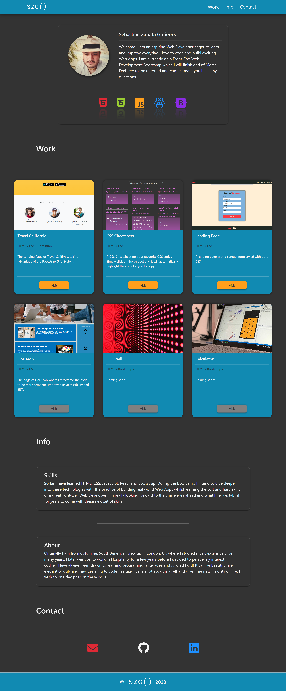

# Bootstrap Portfolio

My Portfolio remade with the power of Bootstrap.
Here I take advantage of Bootstrap's components, 12 column grid system. The use of manual Media Queries have been drastically reduced to Bootstrap's responsive approach.

[**Deployed Project**](https://sebzg.github.io/CSS-Portfolio/)

##
### Technologies / Languages
 - HTML
 - CSS
 - Bootstrap

##
### Resources
- [**Bootstrap**](https://getbootstrap.com/)

##
### Demo

